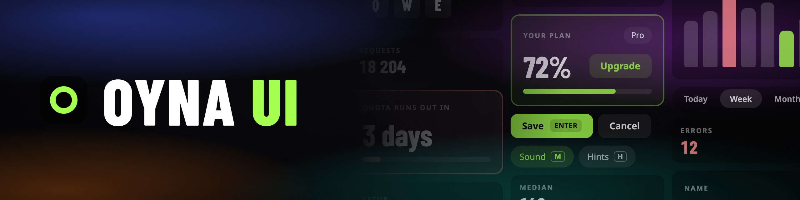

# Oyna UI



[](https://www.npmjs.com/package/oyna-ui)
[](https://github.com/azabroflovski/oyna-ui/actions/workflows/ci.yml)
[](./LICENSE)

A Vue 3 component library. Plain CSS, hotkeys built in.

Docs, installation and live examples: [oyna-ui.org](https://oyna-ui.org). For an AI assistant:
[oyna-ui.org/llms.txt](https://oyna-ui.org/llms.txt).

## What you get

- **42 components**, each with a docs page and a live example.
- **Plain CSS.** One stylesheet, about 7 kB gzipped. No Tailwind or UnoCSS, no build plugin, no
  config file. If you use one of them, the tokens are there as its utilities.
- **CSS variables.** Colours, radii and fonts are `--o-*` variables: set them on `:root` or on one
  part of the page. There is a [theme editor](https://oyna-ui.org/theme).
- **Hotkeys.** A button or a toggle shows its key and reacts to it. Keys are read by position, so
  they work on any keyboard layout, and they are off while the user types.
- **A background.** Generated in CSS, no image files.
- **Reka UI underneath.** The one runtime dependency. Dialogs, menus, selects and tooltips get focus
  handling, keyboard navigation and ARIA from it.
- **ESM, typed, tree-shakable.** One file per component, TypeScript types included.
- **Reduced motion.** One variable turns every transition off.

Not included, and not planned: a light theme, a data grid, a date picker, a tree view.

## Why it exists

I was building [invoke.wtf](https://invoke.wtf), a trainer for Invoker from Dota 2, and wanted a UI
kit that looked the way I had in mind: dark glass, no grey borders, everything on the keyboard. The
Vue kits I tried all looked like admin panels, so I drew the interface by hand.

Oyna UI is that look taken out of the project and made into a library. I made it for myself. If it
suits your project, use it too. _Oyna_ is Uzbek for "glass", and also for "window" and "mirror".

The rules the components follow are on [Why Oyna UI](https://oyna-ui.org/guide/why).

## Development

```bash
bun install
bun run dev          # playground
bun run docs:dev     # docs site
bun run fmt          # format with oxfmt
bun run lint && bun run typecheck && bun run test && bun run build
bun run pack:check   # the packed library in a fresh Vite project
```

The repository is developed with [Bun](https://bun.sh); to use the library, any package manager works.
`typecheck` needs Node on your `PATH`; the rest runs on Bun alone.

[AGENTS.md](./AGENTS.md) has the structure, the conventions and the open decisions. Changes are in
[CHANGELOG.md](./CHANGELOG.md).

## License

[MIT](./LICENSE)
